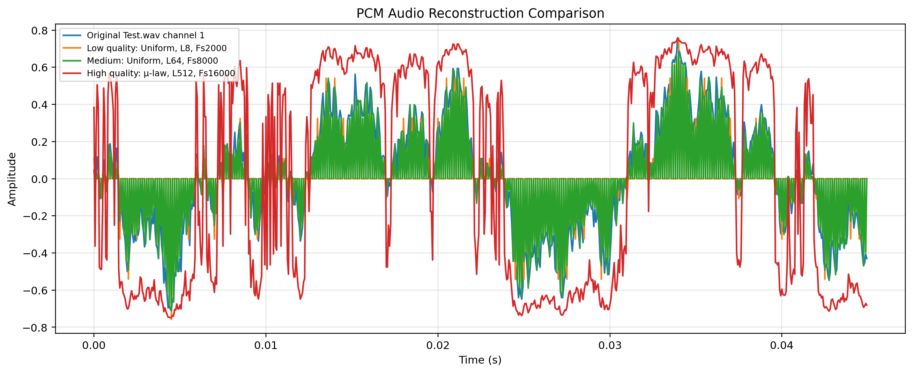
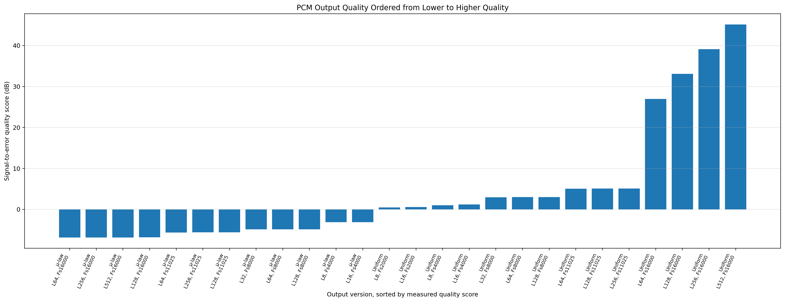
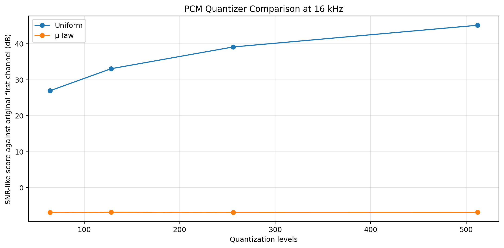
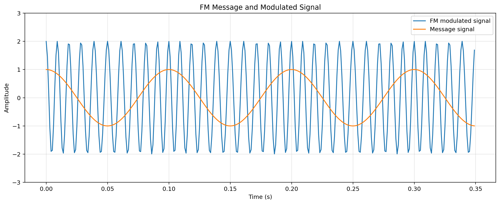
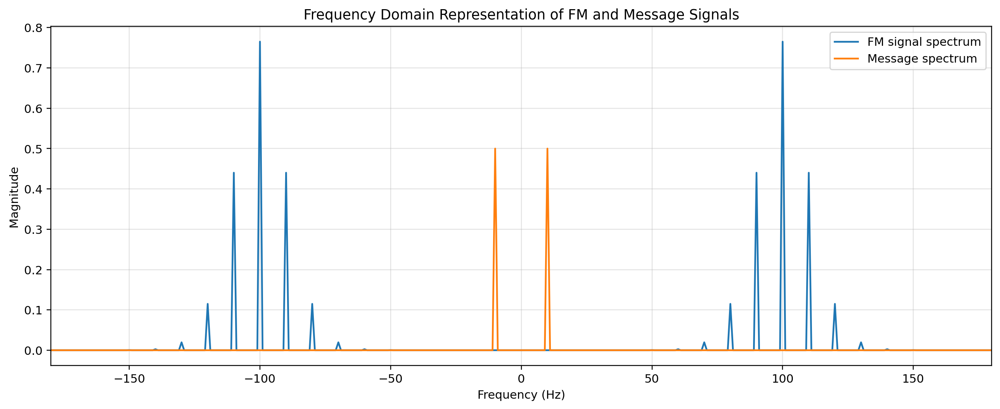
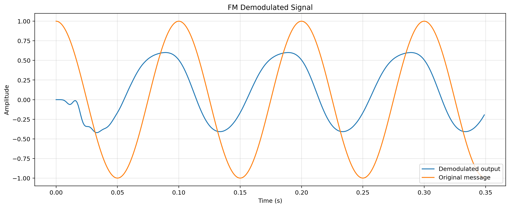
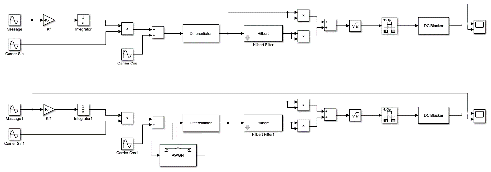
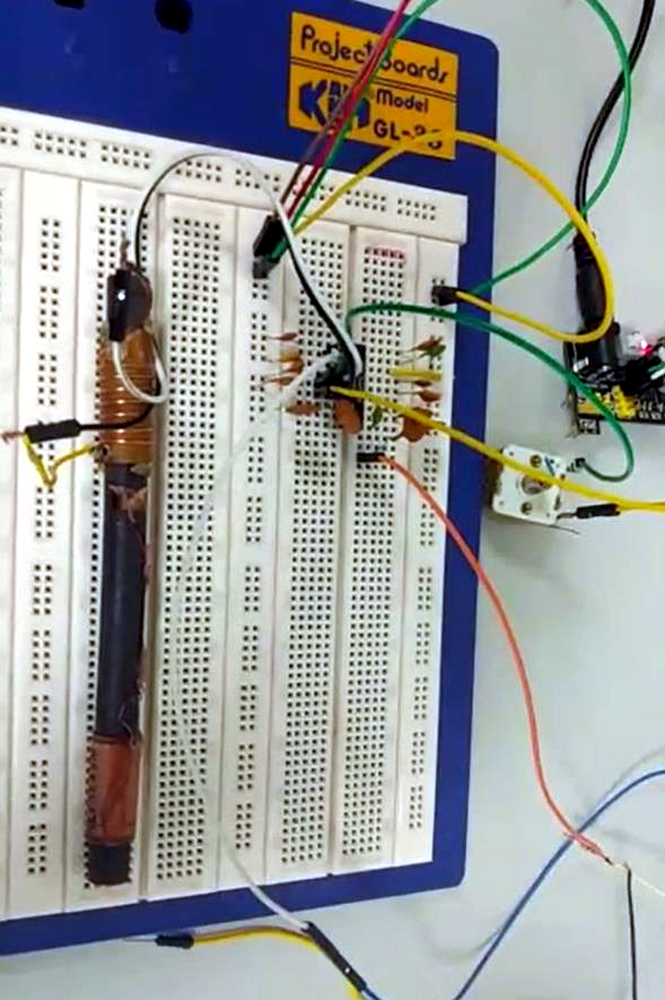
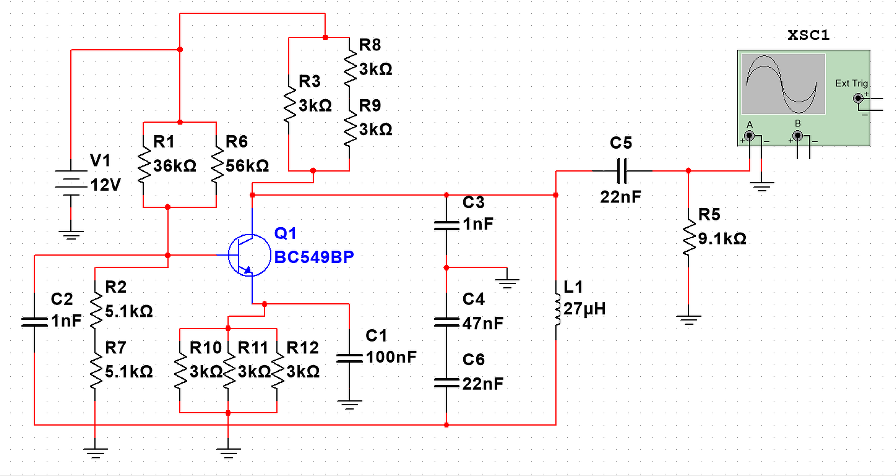
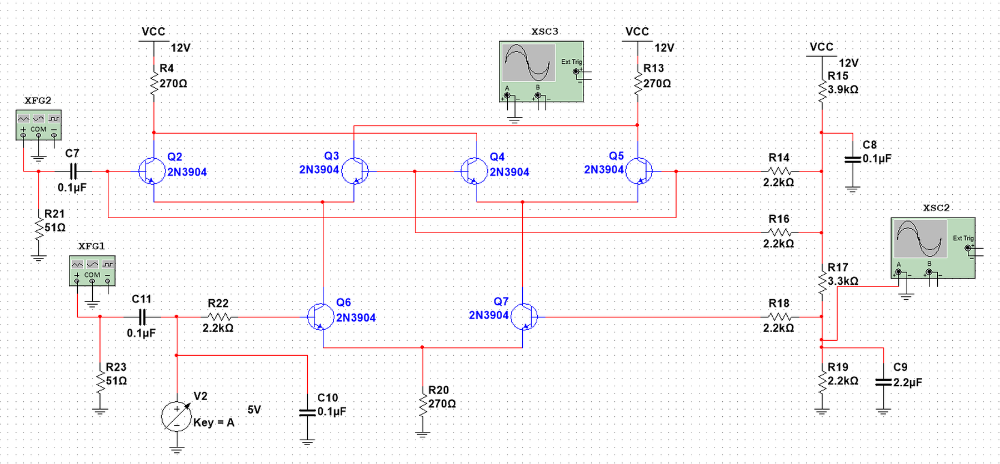

# PCM and FM Communication Systems

This project includes MATLAB Pulse Code Modulation (PCM) simulator, FM communication-system MATLAB script, Simulink model, and Multisim transmitter-components design.

## Preview



The PCM comparison shows how different sampling and quantization settings affect reconstructed audio from `Test.wav`.



The output quality summary lists the PCM audio outputs from lowest to highest quality based on a signal-to-error score in dB. Negative values are kept, because they have signal-processing meaning: they are for cases when the reconstruction error exceeds the signal power in this mode of comparison.



The quantizer comparison focuses on the 16 kHz output files and compares uniform quantization with μ-law companding across different quantization levels.



The FM MATLAB simulation shows the frequency modulated carrier signal and the original message signal.



Frequency domain view compares the spectrum of the message signal with the spectrum of the generated FM signal.



The demodulation simulation compares the recovered output with the original signal message.



The Simulink model represents the FM communication system using block-diagram simulation.



The hardware implementation section documents the FM receiver circuit assembled and tested.



The Multisim design shows transmitter-side circuit components used in the FM hardware section.



The Gilbert multiplier circuit is part of the analog communication-system hardware design.

## Contents

* `matlab/pcm-simulator/` — MATLAB PCM simulator source files, helper functions, input audio, and output audio examples
* `matlab/fm-system/` — MATLAB FM communication-system script
* `simulink/` — Simulink model
* `multisim/` — Multisim transmitter-components design

## Main Features

* MATLAB PCM simulator for sine-wave and audio-file input
* Audio sampling, quantization, encoding, decoding, and reconstruction
* Multiple reconstructed audio outputs under `matlab/pcm-simulator/Outputs/`
* MATLAB FM signal generation and demodulation script
* Simulink FM communication-system model
* Multisim transmitter-components circuit design

## PCM Simulator

The PCM simulator processes either a sine-wave signal or an audio signal. For audio input, the project uses `Test.wav`, applies the PCM stages, and produces reconstructed audio outputs.

The PCM workflow includes:

* Sampling
* Quantization
* Encoding
* Decoding
* Reconstruction
* Audio output generation

The main PCM files are:

| File or folder                       | Purpose                                                                             |
| ------------------------------------ | ----------------------------------------------------------------------------------- |
| `matlab/pcm-simulator/PCM.m`         | Main PCM simulator script                                                           |
| `matlab/pcm-simulator/SinSignal.m`   | Class for sine-wave input                                                           |
| `matlab/pcm-simulator/SoundSignal.m` | Class for audio-file input                                                          |
| `matlab/pcm-simulator/Functions/`    | Helper functions for sampling, quantization, encoding, decoding, and reconstruction |
| `matlab/pcm-simulator/Test.wav`      | Original input audio file                                                           |
| `matlab/pcm-simulator/Outputs/`      | Reconstructed PCM audio outputs                                                     |

## PCM Output Examples

The output files are stored under `matlab/pcm-simulator/Outputs/`.

The files use different sampling frequencies, quantization levels, and quantization methods.

| File                                   | Quantizer     | Levels | PCM sampling frequency | Quality/use    |
| -------------------------------------- | ------------- | -----: | ---------------------: | -------------- |
| `pcm_output_uniform_L8_Fs2000.wav`     | Uniform       |      8 |                2000 Hz | Low / degraded |
| `pcm_output_uniform_L16_Fs2000.wav`    | Uniform       |     16 |                2000 Hz | Low / degraded |
| `pcm_output_uniform_L8_Fs4000.wav`     | Uniform       |      8 |                4000 Hz | Low / degraded |
| `pcm_output_mulaw255_L8_Fs4000.wav`    | μ-law (μ=255) |      8 |                4000 Hz | Low / degraded |
| `pcm_output_uniform_L16_Fs4000.wav`    | Uniform       |     16 |                4000 Hz | Low / degraded |
| `pcm_output_mulaw255_L16_Fs4000.wav`   | μ-law (μ=255) |     16 |                4000 Hz | Low / degraded |
| `pcm_output_uniform_L32_Fs8000.wav`    | Uniform       |     32 |                8000 Hz | Medium         |
| `pcm_output_mulaw255_L32_Fs8000.wav`   | μ-law (μ=255) |     32 |                8000 Hz | Medium         |
| `pcm_output_uniform_L64_Fs8000.wav`    | Uniform       |     64 |                8000 Hz | Medium         |
| `pcm_output_mulaw255_L64_Fs8000.wav`   | μ-law (μ=255) |     64 |                8000 Hz | Medium         |
| `pcm_output_uniform_L128_Fs8000.wav`   | Uniform       |    128 |                8000 Hz | Medium         |
| `pcm_output_mulaw255_L128_Fs8000.wav`  | μ-law (μ=255) |    128 |                8000 Hz | Medium         |
| `pcm_output_uniform_L64_Fs11025.wav`   | Uniform       |     64 |               11025 Hz | Medium         |
| `pcm_output_mulaw255_L64_Fs11025.wav`  | μ-law (μ=255) |     64 |               11025 Hz | Medium         |
| `pcm_output_uniform_L128_Fs11025.wav`  | Uniform       |    128 |               11025 Hz | Good           |
| `pcm_output_mulaw255_L128_Fs11025.wav` | μ-law (μ=255) |    128 |               11025 Hz | Good           |
| `pcm_output_uniform_L256_Fs11025.wav`  | Uniform       |    256 |               11025 Hz | Good           |
| `pcm_output_mulaw255_L256_Fs11025.wav` | μ-law (μ=255) |    256 |               11025 Hz | Good           |
| `pcm_output_uniform_L64_Fs16000.wav`   | Uniform       |     64 |               16000 Hz | Medium         |
| `pcm_output_mulaw255_L64_Fs16000.wav`  | μ-law (μ=255) |     64 |               16000 Hz | Medium         |
| `pcm_output_uniform_L128_Fs16000.wav`  | Uniform       |    128 |               16000 Hz | Good           |
| `pcm_output_mulaw255_L128_Fs16000.wav` | μ-law (μ=255) |    128 |               16000 Hz | Good           |
| `pcm_output_uniform_L256_Fs16000.wav`  | Uniform       |    256 |               16000 Hz | High           |
| `pcm_output_mulaw255_L256_Fs16000.wav` | μ-law (μ=255) |    256 |               16000 Hz | High           |
| `pcm_output_uniform_L512_Fs16000.wav`  | Uniform       |    512 |               16000 Hz | High           |
| `pcm_output_mulaw255_L512_Fs16000.wav` | μ-law (μ=255) |    512 |               16000 Hz | High           |

The highest-quality outputs are the `Fs16000` files with `L256` or `L512`.

## FM System

The FM part includes:

* MATLAB FM communication-system simulation
* Simulink model
* Multisim transmitter-components design

The main FM files are:

| File or folder                         | Purpose                                |
| -------------------------------------- | -------------------------------------- |
| `matlab/fm-system/FM_Com_System.m`     | MATLAB FM communication-system script  |
| `simulink/Simulink.slx`                | Simulink model                         |
| `multisim/Transmitter Components.ms14` | Multisim transmitter-components design |

## How to Run / Review

Open MATLAB and run the PCM simulator:

```matlab
matlab/pcm-simulator/PCM.m
```

The FM MATLAB script is located at:

```text
matlab/fm-system/FM_Com_System.m
```

The Simulink model is located at:

```text
simulink/Simulink.slx
```

The Multisim design is located at:

```text
multisim/Transmitter Components.ms14
```

## Limitations

This is a simple communications project involving PCM simulation, FM system modeling and simple hardware-oriented communication-system design. It is not intended to be a full production communication system.
